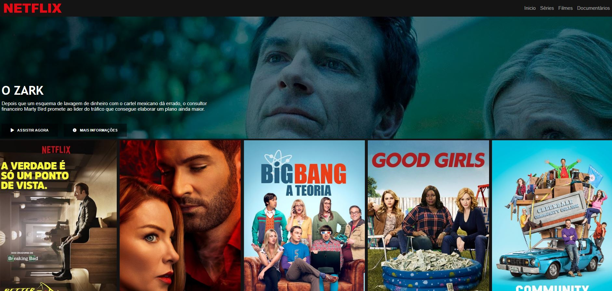

<h1 align="center"><strong>Netflix Clone</strong></h1>

Projeto da DIO. Recriando a interface do principal site de streaming mundial utilizando tecnologias simples como HTML5, CSS3 e JavaScript. Nesse projeto foi praticado: como estruturar um layout, técnicas de CSS3 com containers e variáveis, como posicionar os elementos com Flexbox e como utilizar plugins JQuery a favor da aplicação. Fiz algumas alterações no layout e customizei as séries de acordo com o que mais gosto de assistir com minha noiva.
 

 

Autor

Kauê Jacyntho

[Linkedin](www.linkedin.com/in/kauekaj)
